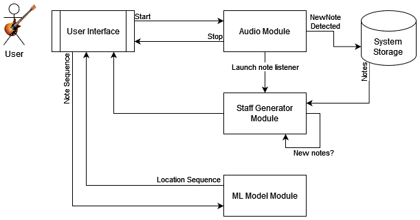
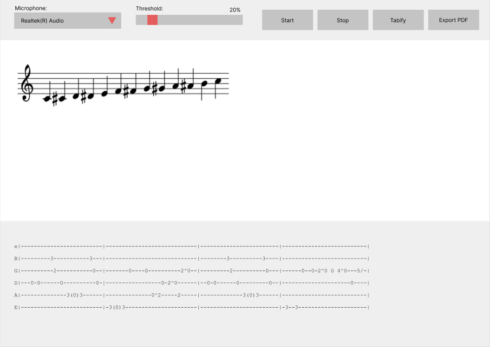
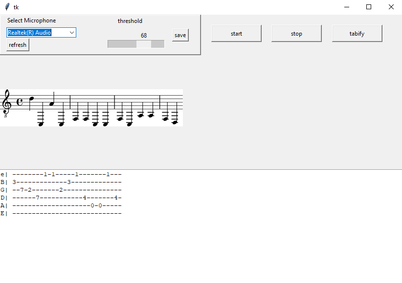

# M-Audio Repository

This repository contains BSci CompSci final year dissertation project.

**Title:** Real-Time Transcription of Guitar

**Key Objective:** Provide a User Interface that enables real-time transcription of guitar. 

**Abstract:** Music Transcription is the process of converting music into written notation. This project attempts to
achieve this task in real-time. The problem is initially broken down into two fundamental components. Pitch Detection and Note Localisation. Pitch Detection focuses on obtaining the note and the octave
  through frequency conversion. Note Localisation focuses on localising the note-octave combination
  to the fretboard of the guitar. To select the method for each component - prior evaluation of existing
  methods is conducted. Pitch Detection methods (Yin, Average Magnitude Difference Function and Fast
  Fourier Transform) are evaluated against a dataset of >32k guitar note recordings. Note Localisation
  methods (Long Short Term Memory and Gated Recurrent Unit Neural Network Models) are trained and
  evaluated against a web-scraped dataset of >3k Tablatures. This project proposes and implements a
  modular system, developed in Python, that offers real-time transcription of guitar.

To request the full paper please contact me on _definaly@gmail.com_.

### Architecture:

The system has been implemented in modules. These modules can be found in _python/app/classes_ folder.

- _python/app/classes/audio.py_ => **Audio Module**
- _python/app/classes/staffgen.py_ => **Staff Generator Module**
- _python/app/classes/model.py_ => **ML Model Module**

The classes are imported & used by the User Interface, located in _app.py_.

### Initial Design:

This is the proposed design of the system:

This is the actual design of the system:

### Credits:
To evaluate existing Pitch Detection methods, two existing repositories were used. 
The results from the evaluation are processed in _evaluation/pitch_detection_analysis.ipynb_.

I want to thank the authors of these repositories:
- [@ashokfernandez/Yin-Pitch-Tracking](https://github.com/ashokfernandez/Yin-Pitch-Tracking)
- [@dafyddg/PyAMDF](https://github.com/dafyddg/PyAMDF)

### AI Model:
This project uses an LSTM model trained on web scraped data. 
The data scraping was done via **gather/extract.py**, and then processed via **transform.py**. 
The extracted data can be found in **evaluation/data/tabs.csv**.

The model was trained and tested in **note_localisation_analysis.ipynb**.

### Prerequisites:
1. pip install -r python/requirments.txt
2. pip install -r requirements.txt _(this is a larger file containing the pip freeze without removing any unused dependencies. You might not need to run this step but if something isn't working, do.)_
3. To install pyaudio run `pip install pipwin` `pipwin install PyAudio` (if you're on Windows)

### Label Audio from `.wav` file:
1. Split the file into chunks using `python python/split.py python/data/test1.wav python/data/temp 10 -27`. Parameters 10 & -27 are min_silence_length and silence threshold (might need tweaking depending on file)
2. Estimate frequencies using `python python/batch_extract.py data/temp/test1`. This file has 2 implementations - FFT & Yin which can be switched by removing comment.

### Potential issues:

1. This project requires numpy==1.18. It's recommended to
setup venv and install specific version via `pip install numpy==1.18`

*venv docs:* https://packaging.python.org/en/latest/guides/installing-using-pip-and-virtual-environments/
